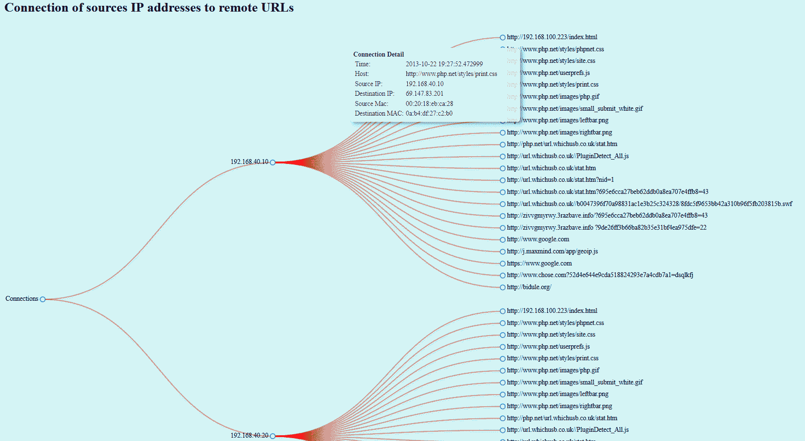

## What is it ##

This visualization script displays a D3JS dendrogram which shows the relationship between a source IP address and all remote URLs this IP tried to connect.

## Installation ##

git clone this repository anywhere into your hard drive.

All pcap files must be stored into the **./traces** directory.

First run the **1-parse_http_in_pcap.py**

	python 1-parse_http_in_pcap.py
	
All pcap file will be parsed and the result will be stored into the **data.json** file.

a file named **resulting_pcap.csv** will be created as well.

Second start the web server

	python 2-start_web_server.py
	
And then open your browser to **http://{ web server IP address }:8888**.

And normally you should see the D3JS dendogram graph.

## Result ##

## Credit ##

- https://www.youtube.com/watch?v=lS6o0oeiGNs
